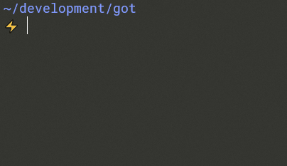
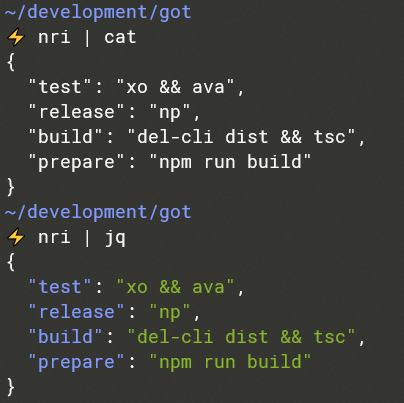

# npm-run-interactive

Find and run scripts in your `package.json` in an interactive way.



## Installation

```sh
npm i npm-run-interactive -g
```

## Usage

Navigate in your project's directory and just run `nri` to see a list of all your npm/yarn scripts that you can then execute.

### Navigation

Cycle through the scripts with the `up`/`down` arrows or `tab`/`shift+tab`.

### Filtering

Filter the scripts by typing in the prompt, your input will be searched in **script names** and **values**.

### Non-interactive mode

Skip the prompt and just view your scripts in JSON format by redirecting output to a non-interactive stdout (file, `cat`, `jq` etc).


